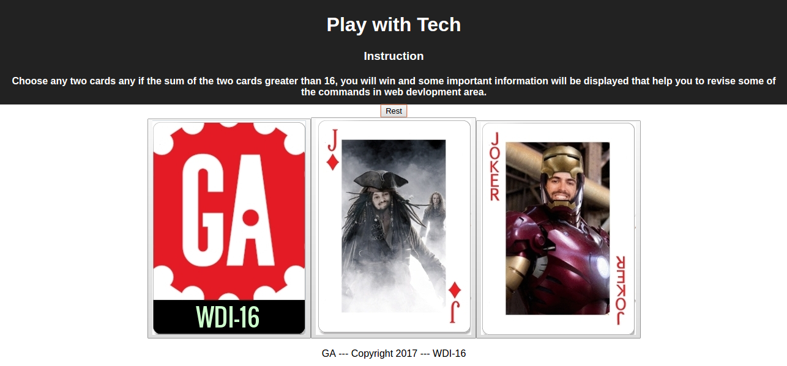

Motivation/ Objective:

    The app is built to revise important web development commands while play cards.

Technologies used:
    HTML, CSS, Node.js, and React.js

Challenges:

    Integrating Twitter Strategy
    The issues related to "Convention vs configuration"
    To store image files and URL into database

Future plan:

    To use different component and route for reward.
    To put add more logic and provide options to choose between technologies and also different modes (easy, medium, hard).

Screen shots
  
